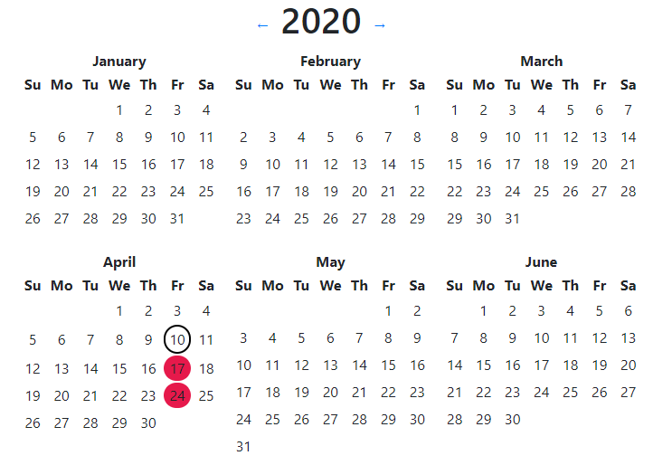

Simple calendar app to track day events (days you worked out, days you took your medicine etc.)

You can click on the day to mark or unmark it.

Data is stored in localStorage and therefore is prone to occasional loss.

You can keep different calendars by specifying `?c=` or `?calendar=` url parameter to some value, e.g.
`?c=name`.
